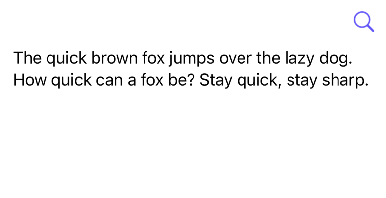

# TextSearchKit

[](https://swift.org)
[](https://developer.apple.com/ios/)
[](https://swift.org/package-manager/)
[](https://github.com/A-bv/TextSearchKit/actions/workflows/ci.yml)

Search UI for `UITextView`.



<sub>Rendered preview generated from the package — no system keyboard. [How it's made](Docs/demo-gif.md).</sub>

- iOS 13+
- Swift Package Manager
- No dependencies
- Highlights matches without destroying existing text attributes

## Install

Use Swift Package Manager:
[A-bv/TextSearchKit.git](https://github.com/A-bv/TextSearchKit.git)

```swift
.package(url: "https://github.com/A-bv/TextSearchKit.git", from: "1.1.0")
```

## Usage

```swift
import UIKit
import TextSearchKit

final class ViewController: UIViewController {
    private let textView = UITextView()
    private let searchBar = TextSearchBar()

    override func viewDidLoad() {
        super.viewDidLoad()

        searchBar.attach(to: textView)

        let stack = UIStackView(arrangedSubviews: [
            searchBar,
            textView,
            searchBar.resultsLabel
        ])
        stack.axis = .vertical
        stack.translatesAutoresizingMaskIntoConstraints = false
        view.addSubview(stack)

        NSLayoutConstraint.activate([
            stack.topAnchor.constraint(equalTo: view.safeAreaLayoutGuide.topAnchor),
            stack.leadingAnchor.constraint(equalTo: view.leadingAnchor),
            stack.trailingAnchor.constraint(equalTo: view.trailingAnchor),
            stack.bottomAnchor.constraint(equalTo: view.safeAreaLayoutGuide.bottomAnchor),
        ])
    }
}
```

## Configuration

```swift
let searchBar = TextSearchBar(configuration: .init(
    placeholder: "Find",
    accentColor: .systemIndigo,
    keyboardType: .default
))
```

## Keyboard Shortcuts

```swift
override var keyCommands: [UIKeyCommand]? {
    searchBar.searchKeyCommands
}
```

- `Cmd+F`: open search
- `Cmd+G`: next match
- `Cmd+Shift+G`: previous match

## API

### `TextSearchBar`

| Member | Description |
|---|---|
| `init(configuration:)` | Create the bar with optional placeholder, accent color, keyboard type. |
| `attach(to:)` | Connect the bar to a `UITextView`. Call once before adding to your layout. |
| `beginSearch()` / `endSearch()` | Open or close the bar programmatically (e.g. from a nav-bar button). |
| `resultsLabel` | A plain `UILabel` showing "X of Y" — place it anywhere. |
| `searchKeyCommands` | `UIKeyCommand`s for Cmd+F / Cmd+G / Cmd+Shift+G. |
| `onActiveChange` | Callback fired with `true` when search opens, `false` when it closes. |

While search is active the text view is made non-editable; closing search restores
its previous `isEditable` state.

### `UITextView` helpers

If you only need highlighting without the bar:

| Member | Description |
|---|---|
| `highlight(query:color:activeRange:)` | Highlights every match; returns the ranges. Preserves existing attributes and restores them when cleared with an empty query. |
| `matchPositions(for:)` | Every case-insensitive match as `[MatchResult]`. |
| `scrollToFirstMatch(of:)` | Scrolls the first match into view. |

## Limitations

- Matching is **literal and case-insensitive** — not a regex search (special
  characters are matched verbatim). Whitespace-only queries highlight nothing.
- All UI strings (accessibility labels, key-command titles, the "X of Y" counter)
  are localized via the package bundle. English ships by default; add an
  `<lang>.lproj/Localizable.strings` to provide more languages.
- The `UITextView` highlight helpers write directly to the text view's storage.
  Clear the highlight (empty query) before mutating the text — editing while
  highlighted can leave stale ranges. `TextSearchBar` handles this for you by
  locking editing during search.

## Building & testing

TextSearchKit is iOS-only (UIKit), so `swift build` / `swift test` fail on macOS
with `no such module 'UIKit'`. Build and test against an iOS simulator instead:

```sh
xcodebuild test -scheme TextSearchKit \
  -destination 'platform=iOS Simulator,name=iPhone 16'
```

Substitute any installed simulator from `xcrun simctl list devices available`.

## License

MIT
