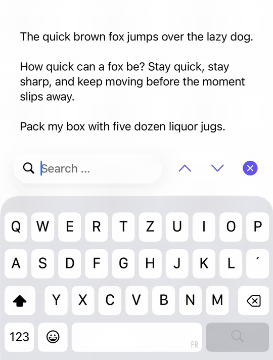

# TextSearchKit

A drop-in find-and-highlight bar for `UITextView`. Attach `TextSearchBar` to any text view: it highlights matches as you type, counts them, and steps through them, without touching your existing text formatting. No dependencies.

[](https://github.com/A-bv/TextSearchKit/actions/workflows/ci.yml)


[](LICENSE)

<p align="center">
  
</p>

## Why this exists

TextSearchKit lets users search text in a `UITextView` on **iOS 15 and below**, where there is no native option: a built-in find bar only arrived with iOS 16 ([`UIFindInteraction`](https://developer.apple.com/documentation/uikit/uifindinteraction)). It was extracted from an older app and kept rather than deleted, so projects on those targets still have it.

## Install

Swift Package Manager. In Xcode, **File ▸ Add Package Dependencies…** with:

```
https://github.com/A-bv/TextSearchKit
```

## Usage

Attach the bar to your text view and place it, with its results label, in your layout.

```swift
import UIKit
import TextSearchKit

final class ViewController: UIViewController {
    private let textView = UITextView()
    private let searchBar = TextSearchBar()

    override func viewDidLoad() {
        super.viewDidLoad()
        searchBar.attach(to: textView)

        let stack = UIStackView(arrangedSubviews: [searchBar, textView, searchBar.resultsLabel])
        stack.axis = .vertical
        stack.translatesAutoresizingMaskIntoConstraints = false
        view.addSubview(stack)

        NSLayoutConstraint.activate([
            stack.topAnchor.constraint(equalTo: view.safeAreaLayoutGuide.topAnchor),
            stack.leadingAnchor.constraint(equalTo: view.leadingAnchor),
            stack.trailingAnchor.constraint(equalTo: view.trailingAnchor),
            stack.bottomAnchor.constraint(equalTo: view.safeAreaLayoutGuide.bottomAnchor),
        ])
    }
}
```

Tap the magnifying-glass button to expand the search bar, search for any word, navigate matches with the arrows, then collapse it back to the button. You can also open and close it in code with `beginSearch()` and `endSearch()`.

### Keyboard shortcuts

```swift
override var keyCommands: [UIKeyCommand]? { searchBar.searchKeyCommands }
```

`Cmd+F` opens search, `Cmd+G` and `Cmd+Shift+G` step forward and back.

### Highlight without the bar

The engine is a `UITextView` extension you can use on its own:

```swift
textView.highlight(query: "swift")     // highlight every match, returns the ranges
textView.matchPositions(for: "swift")
textView.scrollToFirstMatch(of: "swift")
```

## Customization

```swift
let searchBar = TextSearchBar(configuration: .init(
    placeholder: "Find",
    accentColor: .systemIndigo,
    keyboardType: .default
))
```

The accent color tints the buttons and the highlight.

## Behavior

- Matching is literal and case-insensitive; a whitespace-only query highlights nothing.
- Your formatting is kept: fonts, colors, and links survive a highlight and are restored when the search clears.
- Editing pauses during a search and is restored on close, so a read-only text view stays read-only.

## Accessibility

- 44pt minimum tap targets, and controls scale with Dynamic Type.
- VoiceOver announces the "X of Y" position as you step through matches.
- Right-to-left layouts mirror correctly.

## Localization

Built-in strings ship in English; add an `<lang>.lproj/Localizable.strings` to your app for more languages.

## License

MIT. See [LICENSE](LICENSE).
